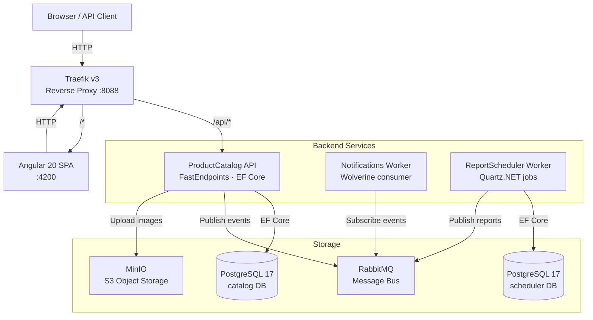
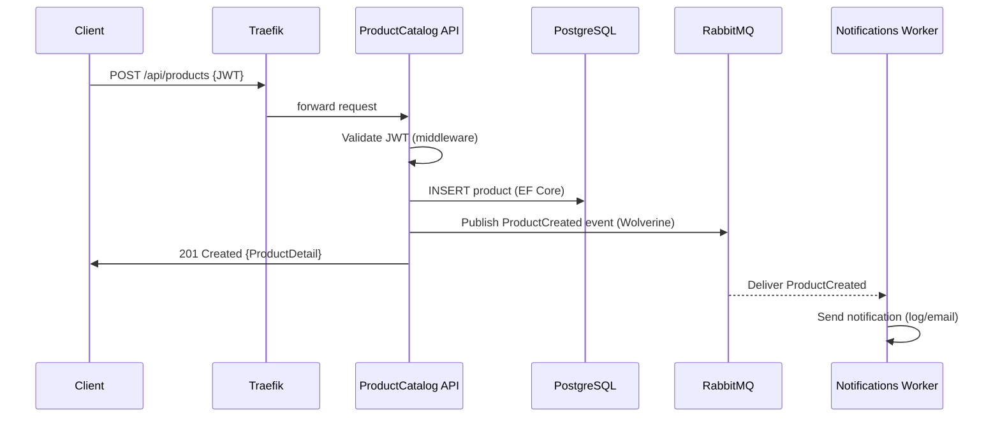

# Architecture

## System Overview

---

## Component Responsibilities

### ProductCatalog API
- **Role:** Core bounded context — manages products and categories
- **Tech:** FastEndpoints (REPR), EF Core 10, Npgsql, MinIO SDK
- **Endpoints:** `GET/POST/PUT/DELETE /api/products`, `GET /api/categories/stats`, `PUT /api/products/{id}/image`
- **Auth:** JWT Bearer — public `GET` endpoints use `AllowAnonymous()`, write endpoints require a valid token
- **Events published:** `ProductCreated`, `ProductDeleted` (via Wolverine)

### Notifications Worker
- **Role:** Reacts to domain events and sends notifications (email/log stub in this scaffold)
- **Tech:** Wolverine message handlers, hosted `Worker` service
- **Messages handled:** `ProductCreated` → welcome notification, `ProductDeleted` → removal notification
- **Transport:** In-process (dev) or RabbitMQ (staging/prod) — one config line changes it

### ReportScheduler Worker
- **Role:** Periodic background jobs — finds stale products, writes audit logs, publishes report events
- **Tech:** Quartz.NET, EF Core (`IDbContextFactory`), Wolverine publisher
- **Jobs:** `StaleProductCleanupJob` — runs every hour, deactivates products not updated in 90 days

### SharedKernel
- **Role:** Cross-cutting library, not a service — never deployed standalone
- **Provides:** Extension methods for DI registration, JWT auth setup, FastEndpoints + Swagger, OpenTelemetry, health checks middleware, `IUserContext`, `MigrateDatabase<T>()` startup helper

---

## Data Flow: Create Product

---

## Three Modes of Running

| Mode | How | What starts |
|---|---|---|
| **Full Aspire** | `dotnet run --project aspire/app-host` | Everything: API, workers, Postgres, RabbitMQ, MinIO, Traefik, Angular, Aspire dashboard |
| **Docker Compose** | `docker compose up` | Infrastructure only (Postgres, RabbitMQ, MinIO, Traefik) — run services with `dotnet run` |
| **Individual** | `dotnet run` per service | One service at a time — set connection strings in `appsettings.Development.json` |

---

## Port Map (default)

| Service | Port |
|---|---|
| Aspire Dashboard | 15000 |
| Traefik HTTP | 8088 |
| Traefik Dashboard | 8081 |
| ProductCatalog API (direct) | 5001 |
| Angular SPA | 4200 |
| PostgreSQL | 5432 |
| RabbitMQ AMQP | 5672 |
| RabbitMQ Management UI | 15672 |
| MinIO S3 API | 9000 |
| MinIO Console | 9001 |
