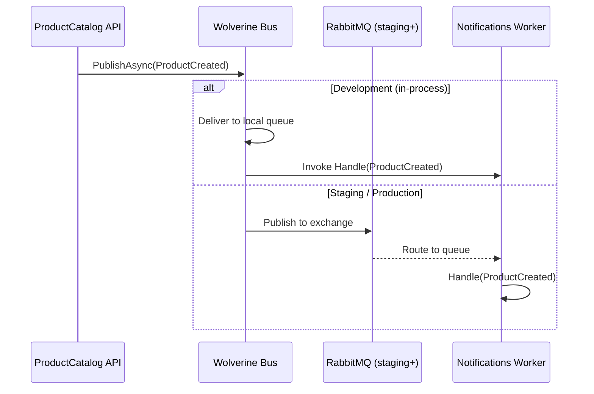

# Wolverine Messaging

## What is Wolverine?

Wolverine is a .NET messaging and mediator library. In NexaCommerce it serves two purposes:

1. **In-process mediator** — the API publishes domain events; handlers in the same process react immediately (development mode)
2. **RabbitMQ transport** — swap one line of config to route messages through RabbitMQ for true async, cross-service delivery (staging/production)

The application code is **identical** in both modes — only the bootstrapping changes.

---

## Message Contract

Messages are plain C# records in `SharedKernel`:

```csharp
// NexaCommerce.SharedKernel/Messages/ProductCreated.cs
public sealed record ProductCreated(
    Guid   ProductId,
    string Name,
    decimal Price,
    string CategoryName);

public sealed record ProductDeleted(
    Guid   ProductId,
    string Name);
```

Records are ideal message contracts:
- Immutable by default
- Value-based equality (useful in tests)
- No infrastructure concerns — just data

---

## Publishing (ProductCatalog API)

```csharp
public sealed class ProductService(
    CatalogDbContext db,
    IMessageBus      bus,   // ← Wolverine's IMessageBus
    ...) : IProductService
{
    public async Task<Result<ProductDetail>> CreateAsync(
        CreateProductRequest request, CancellationToken ct)
    {
        var product = new Product { ... };
        db.Products.Add(product);
        await db.SaveChangesAsync(ct);

        // Publish — in-process or RabbitMQ depending on config
        await bus.PublishAsync(new ProductCreated(
            product.Id, product.Name, product.Price, category.Name));

        return Result.Created(MapToDetail(product));
    }
}
```

`IMessageBus.PublishAsync` is fire-and-forget from the API's perspective. Wolverine handles delivery guarantees, retries, and dead-lettering.

---

## Consuming (Notifications Worker)

Handlers are discovered by convention — **no registration needed**:

```csharp
// NexaCommerce.Notifications/Handlers/ProductCreatedHandler.cs
public sealed class ProductCreatedHandler(INotificationSender sender)
{
    // Method name "Handle" + parameter type = Wolverine handler by convention
    public async Task Handle(ProductCreated message, CancellationToken ct)
    {
        await sender.SendProductCreatedAsync(
            message.ProductId, message.Name, message.Price, ct);
    }
}
```

Wolverine scans assemblies for `Handle(TMessage)` methods. No `IConsumer<T>` interface, no attributes — just a method with the right signature.

---

## Bootstrap — One Config Line to Switch Transport

```csharp
// NexaCommerce.SharedKernel/Extensions/MessagingExtensions.cs
public static IHostBuilder AddMessaging(
    this IHostBuilder hostBuilder,
    string? rabbitMqConnectionString = null)
{
    return hostBuilder.UseWolverine(opts =>
    {
        if (string.IsNullOrEmpty(rabbitMqConnectionString))
        {
            // Development: in-process, no infrastructure required
            opts.LocalQueueFor<ProductCreated>().Sequential();
            opts.LocalQueueFor<ProductDeleted>().Sequential();
        }
        else
        {
            // Staging/Production: real RabbitMQ
            opts.UseRabbitMq(rabbitMqConnectionString)
                .AutoProvision();   // creates exchanges and queues if missing

            opts.PublishMessage<ProductCreated>()
                .ToRabbitExchange("nexacommerce.events");

            opts.PublishMessage<ProductDeleted>()
                .ToRabbitExchange("nexacommerce.events");
        }
    });
}
```

In the API's `Program.cs`:
```csharp
// Development (no RabbitMQ)
builder.Host.AddMessaging();

// Staging/Production (connection string from config/Aspire)
builder.Host.AddMessaging(builder.Configuration.GetConnectionString("rabbitmq"));
```

---

## Message Flow Diagram



---

## Why Not MediatR?

| | MediatR | Wolverine |
|---|---|---|
| Transport | In-process only | In-process → RabbitMQ → Azure SB, zero code change |
| Handler discovery | Registration required | Convention-based (zero registration) |
| Retries / DLQ | Manual | Built-in |
| Outbox pattern | Manual | Built-in (with EF Core) |
| Saga support | No | Yes |

For a learning project that demonstrates real-world messaging patterns, Wolverine shows the full picture.
